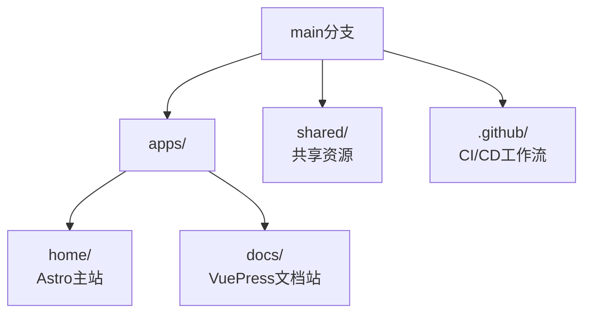
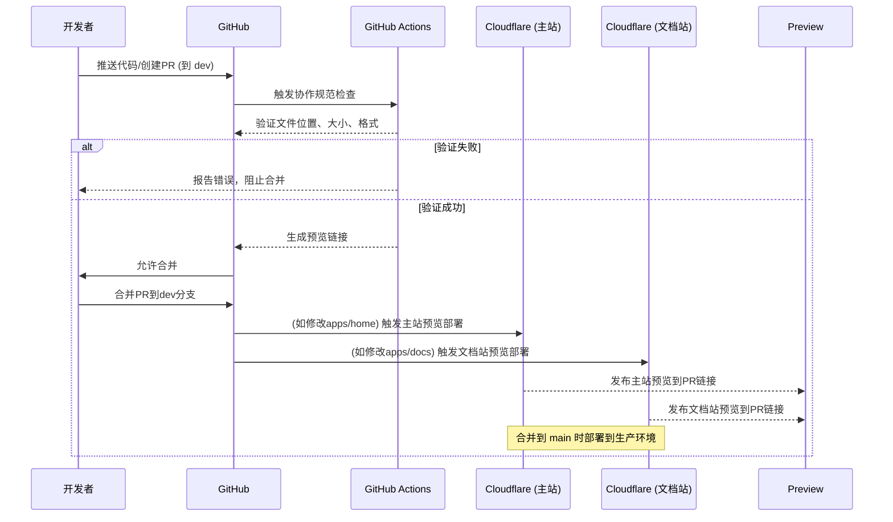

# CTBU-AUTOBOTS 汽车人协会网站

## 项目概览

重庆工商大学汽车人协会网站包含三个站点:

| 站点       | 目录路径    | 技术栈                 | 部署地址                                                   | 内容类型                       |
| ---------- | ----------- | ---------------------- | ---------------------------------------------------------- | ------------------------------ |
| **主站**   | `apps/home` | Astro + Mizuki         | [https://www.autobot5.site](https://www.autobot5.site)     | 协会介绍、新闻、博客、视觉展示 |
| **文档站** | `apps/docs` | VuePress + Theme Plume | [https://docs.autobot5.site](https://docs.autobot5.site)   | 教程、项目说明                 |
| **资源站** | 独立项目    | OpenList               | [https://cloud.autobot5.site](https://cloud.autobot5.site) | 资料下载、网盘整合             |

## 目录结构与职责

本项目采用**单分支多目录架构**，所有代码统一管理在`main`分支:



### 目录职责明确

- **`apps/home/` 目录**：协会主站、博客文章、新闻动态、视觉资源
- **`apps/docs/` 目录**：技术文档、开发规范、教程、项目说明
- **`shared/` 目录**：共享文件
- **`.github/workflows/`**：统一的工作流配置

## 贡献流程

### 1. 确定修改内容所属目录

参考下表确定您的内容应修改哪个目录:

| 内容类型      | 目录路径     | 具体位置            | 示例内容           |
| ------------- | ------------ | ------------------- | ------------------ |
| 主页文章      | `apps/home/` | `src/content/posts` | 主页新闻、公告     |
| 其他页面      | `apps/home/` | `src/content/spec`  | 关于我们、免责声明 |
| 图片/媒体资源 | `apps/home/` | `public/images`     | 活动图片、宣传照片 |
| 项目文档      | `apps/docs/` | `docs`              | ROS 教学文档       |

### 2. Fork 仓库并设置本地环境

1.  **Fork 仓库**:
    *   访问 GitHub 上的原始仓库 `https://github.com/CTBU-AUTOBOTS/ctbu-autobots-websites.git`。
    *   点击右上角的 "Fork" 按钮，将仓库复制到您的个人账户下。

2.  **克隆您 Fork 的仓库 (包含 dev 分支)**:
    ```bash
    # 将 YOUR_USERNAME 替换为您的 GitHub 用户名
    git clone https://github.com/YOUR_USERNAME/ctbu-autobots-websites.git
    cd website
    # 确保获取到 dev 分支（通常 clone 会获取所有分支，但可以明确 fetch）
    git fetch origin
    ```

3.  **设置上游仓库 (Upstream)**:
    *   为了能同步原始仓库的更新，需要将原始仓库添加为上游 (upstream)。
    ```bash
    git remote add upstream https://github.com/CTBU-AUTOBOTS/ctbu-autobots-websites.git
    # 验证远程仓库设置
    git remote -v
    # 应显示 origin (您的 Fork) 和 upstream (原始仓库)
    ```

4.  **环境准备**:
    ##### 系统要求
    ```bash
    # 必须满足以下版本要求
    Node.js >= 20.6.0
    pnpm >= 9.0.0
    Git >= 2.30.0
    ```
    ##### 验证和安装
    ```bash
    # 检查 Node.js 和 npm 版本
    node -v  # 应显示 v20.x.x 或更高
    npm -v   # 应显示 9.x.x 或更高
    
    # 安装 pnpm（如未安装）
    npm install -g pnpm
    
    # 检查 pnpm 版本
    pnpm -v  # 应显示 9.x.x 或更高
    
    # 检查 Git 版本
    git --version  # 应显示 2.30.0 或更高
    ```

5.  **安装依赖**:
    ```bash
    # 安装根级依赖（包含 pnpm 工作区配置）
    pnpm install
    
    # 验证安装成功
    pnpm -r list --depth=0
    ```

### 3. 同步 dev 分支并创建特性分支

1.  **切换到 dev 分支**:
    ```bash
    git checkout dev
    ```

2.  **从上游仓库同步 dev 分支的最新更改**:
    ```bash
    # 获取上游仓库的最新更改
    git fetch upstream
    # 将上游 dev 分支的更改合并到本地 dev 分支
    git merge upstream/dev
    # 将更新后的本地 dev 分支推送到您 Fork 的仓库
    git push origin dev
    ```

### 4. 本地开发与测试

1.  **进行修改**:
    *   根据您的需求修改 `apps/home/` 或 `apps/docs/` 目录下的相应文件。

2.  **本地测试**:
    *   启动开发服务器来预览您的更改。
    ```bash
    # 启动主站开发服务器（Astro + Mizuki）
    pnpm dev
    # 访问 http://localhost:4321
    
    # 启动文档站开发服务器（VuePress + Theme Plume）
    pnpm docs:dev
    # 访问 http://localhost:8080
    ```

### 5. 提交并推送更改

1. **检查更改**:

   ```bash
   git status
   ```

2. **添加更改**:
   ```bash
   git add .
   ```

3.  **提交更改 (遵循规范格式)**:
    
    ```bash
    git commit -m "type(scope): 简要描述更改"
    # 例如: git commit -m "post(home): 添加2025年校长荣誉奖新闻"
    ```
    
    **types** 允许类型：
        `post`     # 发布文章
        `feat`     # 新功能
        `fix`      # 问题修复
        `style`    # 代码样式
        `chore`    # 杂项任务
    **scopes** 允许类型：
        `home`     # 主站内容
        `docs`     # 文档内容
        `config`   # 配置文件

### 6. 创建 Pull Request (PR)

1.  **访问您的 GitHub Fork 仓库**。
2.  **点击 "Compare & pull request" 按钮**。
4.  **配置 PR**:
    *   **标题 (Title)**: `类型(范围): 简要描述`
        *   正确示例:
            *   `post(home): 添加2025年校长荣誉奖新闻`
            *   `fix(docs): 修复文档配置错误`
        *   错误示例: `update files`, `fix bug`
    *   **描述 (Description)**: 详细说明您所做的更改及其原因。
5.  **提交 PR**。

### 7. 等待审核与合并

1.  **等待审核**: 团队成员会审核您的 PR，可能会提出修改建议。
2.  **处理反馈**: 根据审核意见进行修改，再次提交分支。
3.  **PR 合并到 `dev`**: 当 PR 获得批准后，会被合并到 `dev` 分支。
4.  **`dev` 合并到 `main`**: 项目维护者会定期将 `dev` 分支的稳定更改合并到 `main` 分支。

## 内容规范

### 1. 博客/新闻文章规范 (apps/home)

- 使用Markdown编写，文件扩展名为`.md`

- **文件路径**: `apps/home/src/content/posts/`

- 文件名格式: `YYYY-MM-DD.md`

  - 示例: `2024-12-17.md`

- 包含Frontmatter元数据:

  ```markdown
  ---
  title: 【新闻转载】恭喜我院汽车人协会荣获「校长荣誉奖」团队奖项
  description: 重庆工商大学机械工程学院汽车人协会凭借在学科竞赛、科技创新、人才培养与社会实践等方面的突出表现，荣获第九届“校长荣誉奖”团队奖项。
  published: 2024-12-17
  pubDate: 2024-12-17
  date: 2024-12-17
  draft: false
  tags: [转载, 校长荣誉奖, 汽车人协会, 学科竞赛, 科技创新, 机械工程学院, CTBU]
  category: 新闻转载
  pinned: true
  author: 转载
  licenseName: "Unlicensed"
  sourceLink: "https://mp.weixin.qq.com/s/C4DRjGQsT6w6ODKp_gQJ0Q"
  image: "https://lwrzgophoto.oss-cn-guangzhou.aliyuncs.com/%E5%9B%BE%E5%BA%8Aimg/e534d57feb1045b7b23b2d4ad6be8fc3-1761761219808.webp"
  ---
  ```

### 2. 技术文档规范 (apps/docs)

- 使用Markdown编写，文件扩展名为`.md`

- **文件路径**: `apps/docs/docs/`

- 按功能/主题组织目录结构

- 文档包含Frontmatter元数据:

  ```markdown
  ---
  title: ROS 入门第一讲：Robot Operating System
  createTime: 2025/10/31 18:38:11
  permalink: /ros/a46ckw85/
  foo: foo
  ---
  ```

## 重要限制与规范

### 1. 文件大小限制

- **禁止**提交大于20MB的文件到Git仓库
- 大文件(视频、完整工程包)请上传到阿里云盘、蓝奏云等
- 在Markdown中提供网盘链接，而非直接提交文件
- CI/CD会自动拦截超限文件提交

### 2. 图片资源规范

- 优先使用阿里云OSS图床
- 建议使用WebP格式，优化文件大小

## 部署与预览

### 1. 自动部署流程



### 2. 预览环境

- 每个PR会自动创建对应站点的预览链接:
  - **主站预览**: `https://pr-{number}--autobot-home.pages.dev`
  - **文档站预览**: `https://pr-{number}--autobot-docs.pages.dev`
- 预览链接会在PR评论中**自动提供**
- 预览环境通常在2-3分钟内可用

## 常见问题解决

### 1. "我应该修改哪个目录?"

- **博客/新闻/协会介绍/视觉资源** → `apps/home/` 目录
- **技术文档/教程/开发规范** → `apps/docs/` 目录
- **不确定时** → 先提交Issue咨询或联系技术负责人

### 2. PR验证失败怎么办?

- **文件位置错误**: 将更改移动到正确目录
- **文件过大**: 上传到网盘，替换为链接
- **格式问题**: 运行 `pnpm format` 自动修复
- **构建失败**: 检查代码并重试

### 3. 本地开发环境搭建失败

1. 确保Node.js版本≥20

   ```bash
   node -v # 应显示 v20.x.x 或更高
   ```

2. 确保pnpm版本≥9

   ```bash
   pnpm -v # 应显示 9.x.x 或更高
   ```

3. 清除缓存:

   ```bash
   pnpm store prune
   ```

4. 重新安装依赖:

   ```bash
   rm -rf node_modules
   pnpm install --force
   ```

## 联系我们

- **技术问题**: 在[GitHub Issues](https://github.com/CTBU-AUTOBOTS/ctbu-autobots-websites/issues)提交
- **内容建议**: 创建PR或提交Issue
- **紧急事项**: 联系协会技术负责人

## 许可协议

本站点内容采用 [CC BY-NC-SA 4.0](https://creativecommons.org/licenses/by-nc-sa/4.0/) 许可协议。

© 2025 重庆工商大学 汽车人协会（CTBU-AUTOBOTS）
