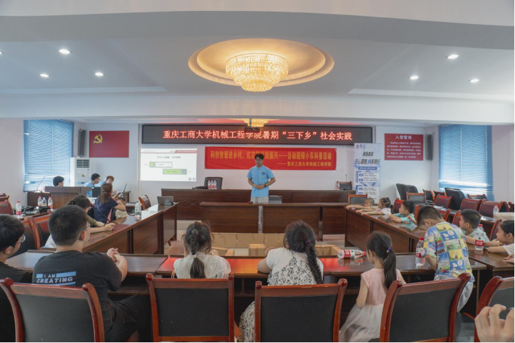
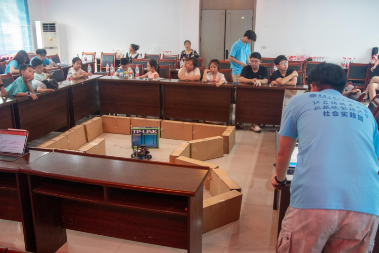
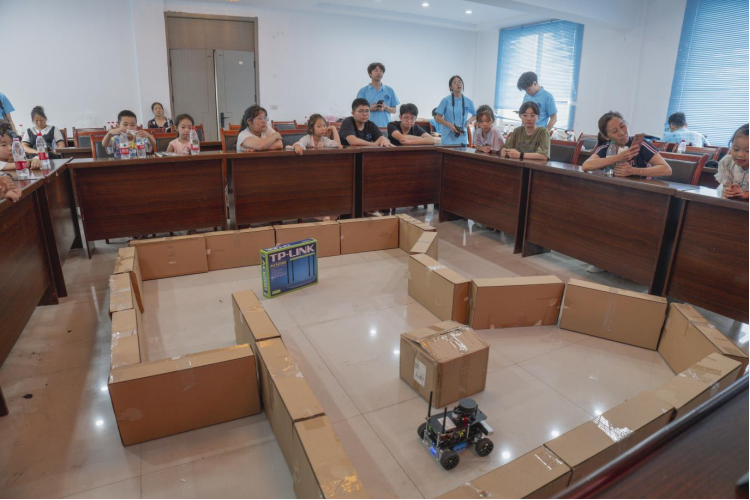
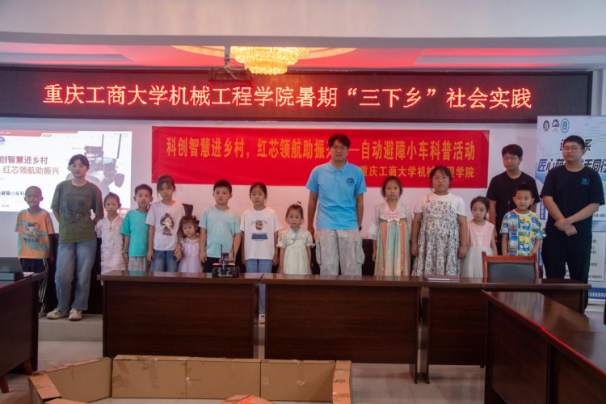

# 【转载】机械工程学院“红岩铸魂乡土情，机械赋能振兴梦”社会实践团开展智能控制主题科普活动

为深入贯彻落实乡村振兴战略，推进科技文化服务乡村，7月8日下午，机械工程学院“红岩铸魂乡土情，机械赋能振兴梦”社会实践团前往重庆市江津区白溪社区，开展“科创智慧进乡村，红芯领航助振兴”智能控制主题科普活动。本次活动由机械工程学院分团委主办，汽车人协会承办，协会成员李定邦担任讲解员和演示人员，吸引了众多社区青少年及居民参与，取得良好反响。

活动现场，李定邦借助PPT生动讲解了自动避障小车的工作原理与核心构造，从激光雷达的识别原理到电机控制算法的运行逻辑，深入浅出地带领观众了解智能小车的科技内核。讲解过程中穿插互动问答，调动了现场学生的积极性。

随后，在预设的障碍路径场地上，自动避障小车灵活穿梭，自动识别并绕过障碍顺利抵达目标点位。演示过程中，李定邦同步剖析其避障路径选择机制，将理论与实践深度融合，使观众更加直观地理解智能控制的应用价值。

此次活动以自动避障小车为媒介，不仅拓展了青少年对科技创新的认知，也激发了他们探索科学的热情。通过讲授智能控制技术在农村快递、农业巡检等场景的潜在应用，引导学生将科技知识与实际问题相结合，展现了新时代大学生的责任与担当。

本次“科创智慧进乡村，红芯领航助振兴”智能控制主题科普活动的成功举办，不仅加强了高校与社区之间的科技文化交流，也为农村青少年提供了近距离接触前沿科技的平台。未来，机械工程学院将持续推进科技下乡实践，助力智慧乡村建设，为乡村振兴贡献青春力量。
