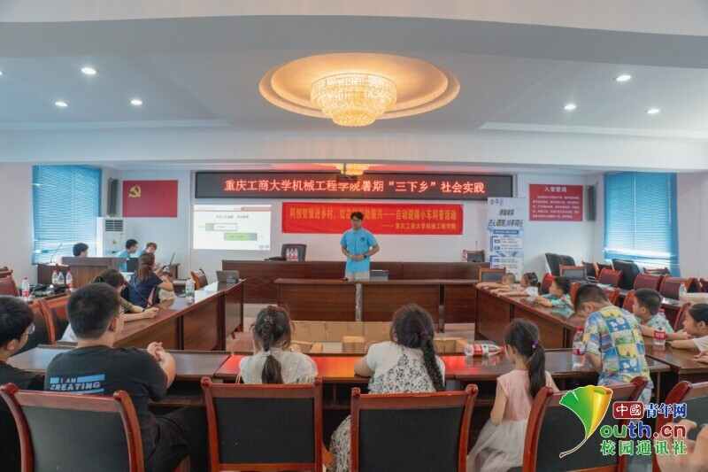
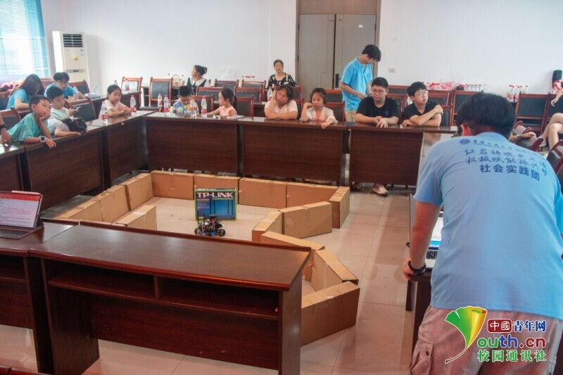
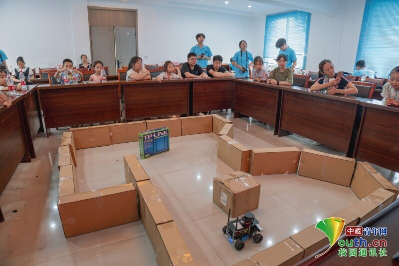
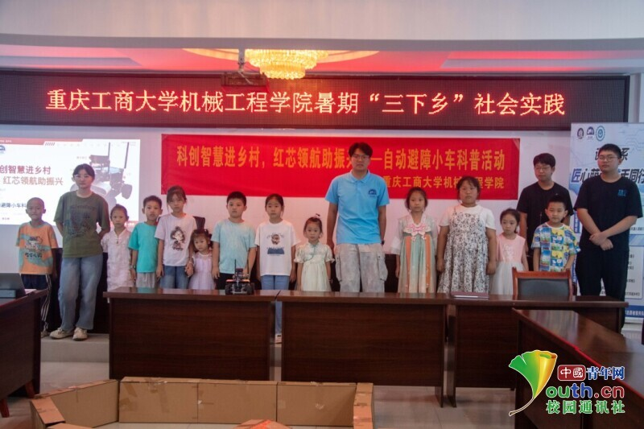

## 【转载】重庆工商大学：智能小车入课堂，科技科普润童心

7月8日，重庆工商大学机械工程学院“红岩铸魂乡土情，机械赋能振兴梦”社会实践团走进重庆市江津区白溪社区，开展以“科创智慧进乡村，红芯领航助振兴”为主题的自动避障小车科普活动。本次活动由重庆工商大学机械工程学院分团委主办，汽车人协会承办，协会成员李定邦担任现场讲解员和演示人员。活动吸引了众多社区青少年和居民参与，现场气氛热烈。

图为李定邦在为白溪社区小朋友们讲解小车通信逻辑。梁瀚文 供图

活动伊始，讲解员通过PPT展示、实物操作和演示视频，为参与人员介绍了自动避障小车的基本结构和运行逻辑。他以激光雷达识别障碍物为切入点，逐层讲解传感器信息采集、数据处理和电机控制等核心环节，帮助大家了解小车完成自主避障的技术流程。为了增强直观性，讲解中使用了贴近生活的举例，将复杂的技术拆解成易于理解的逻辑。

在互动提问环节，孩子们积极发问，围绕小车的工作方式、学习能力及未来应用展开交流。部分问题带有想象色彩，如：“就像我们第一天上学要认路时，小车也在‘记住’怎么走！”同时，家长也在现场参与其中，关注智能小车技术在日常生活与学习中的延伸价值，并向李定邦询问农业自动驾驶器械相关问题。

图为李定邦向白溪社区小朋友们演示小车的避障功能。梁瀚文 供图

随后，李定邦在设置好的障碍路径上现场演示小车运行。小车在激光雷达与控制算法的协同作用下，自主识别前方障碍，灵活调整行进路线，最终准确驶入设定目标区域，赢得了现场孩子们的一片惊叹。

图为白溪社区小朋友们结合实际讲解观察避障小车运动轨迹。梁瀚文 供图

为了进一步展示小车的运行逻辑，李定邦还通过投影系统同步播放了实时采集的雷达数据、路径规划图像及运行决策。方便观众在观看数据与实际运动的对照时，对小车的“感知——决策——执行”过程有更直观的认识。部分家长在交流中表示，以往对自动驾驶的理解只停留在概念层面，此次演示让其运行机理更为清晰。

在讲解建图原理时，李定邦再次使用类比，借助孩子们日常上学熟悉地形与小车自动寻路扩充地图的相似性，对概念进行解析。孩子们听后纷纷点头，还有人马上提问：“那是不是它也能记住哪里有糖果？”家长们也表示：“这样的讲解，孩子们会对智能技术产生更直观的理解。”

活动中，李定邦还结合农村生活实例，介绍了智能控制技术在农业中的实际应用场景，如果园巡检、无人运输等。不少家长和社区工作人员在现场表示，这种形式的活动让“高大上”的技术变得易懂有趣，一位家长现场建议：“以后可以多开类似的课程！我家孩子已经开始对这个特别感兴趣了。”

图为李定邦与白溪社区小朋友们在讲台上合影。梁瀚文 供图

本次“科创智慧进乡村，红芯领航助振兴”科普活动，为农村青少年搭建了一个近距离接触科技、了解科学原理的实践平台，也进一步促进了高校与基层社区在科技教育方面的交流与合作。通过贴近生活、寓教于乐的方式，孩子们不仅对智能技术产生了兴趣，也开始主动思考科技如何融入日常生活。未来，重庆工商大学机械工程学院将继续发挥专业优势，开展更多面向乡村的科技科普和文化实践活动，在服务基层的过程中不断探索适合农村青少年特点的教育形式，为智慧乡村建设注入青春力量。（通讯员 李昊展）
