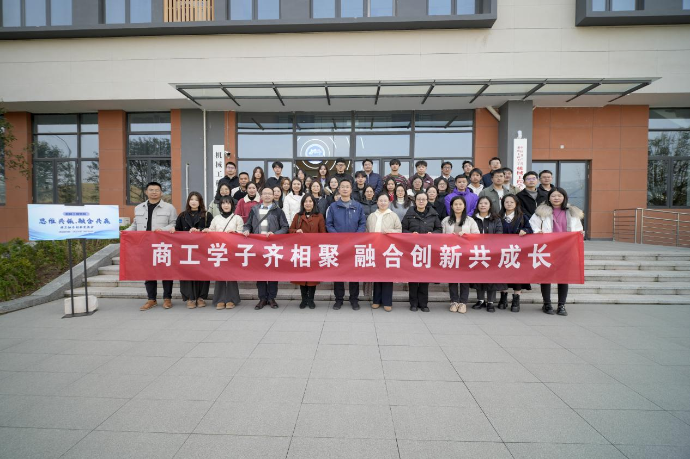
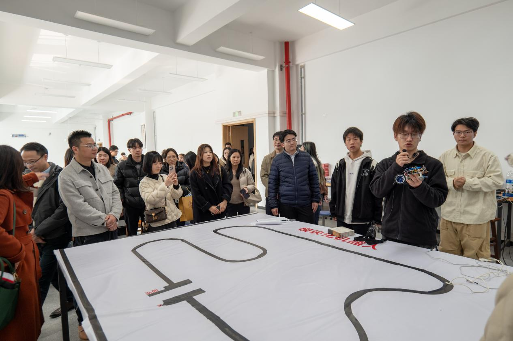
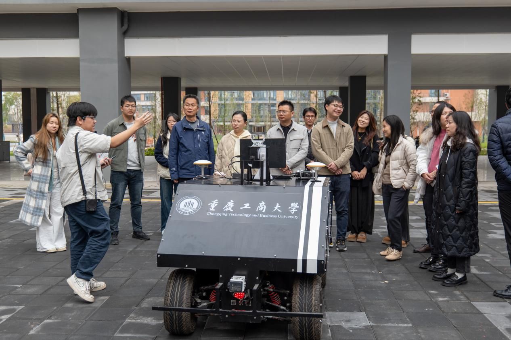
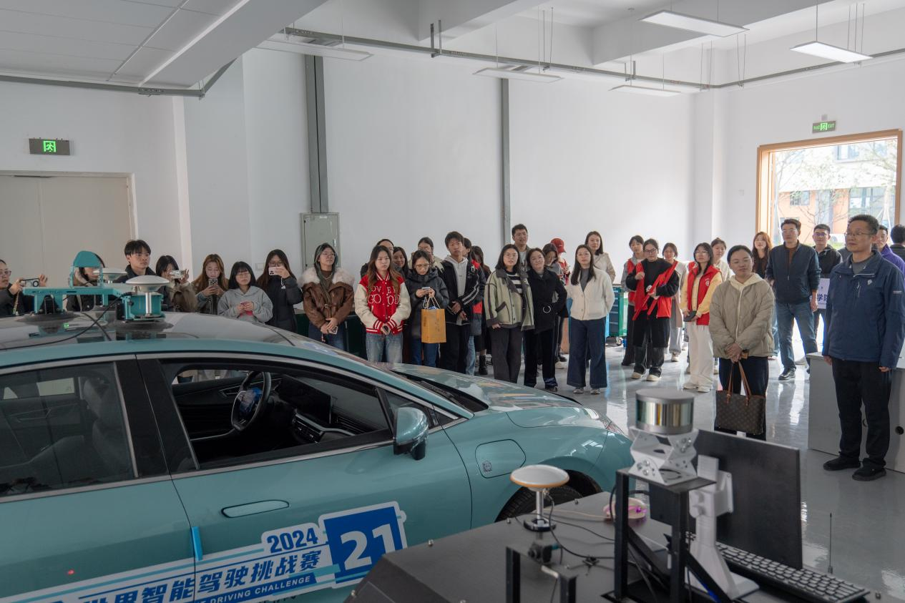
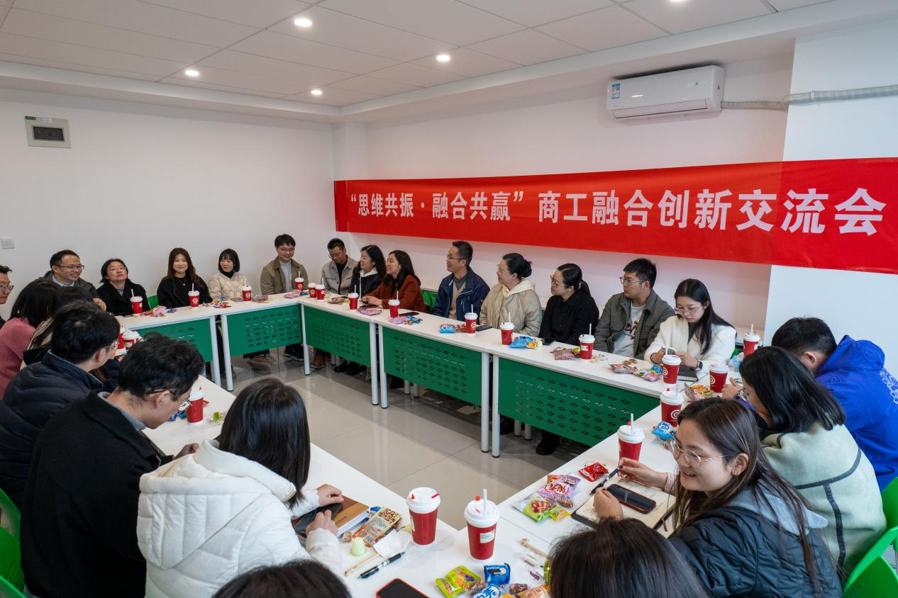
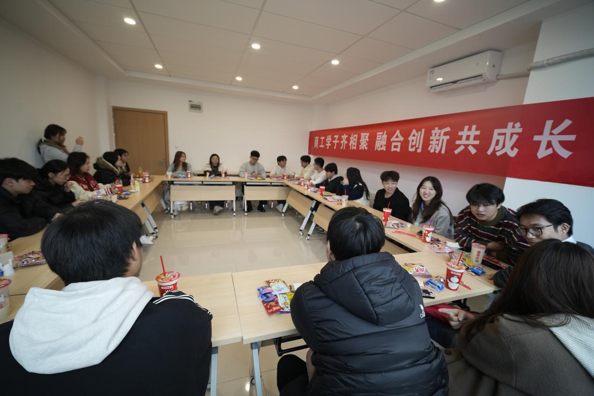

# 【转载】机械工程学院与工商管理学院联合举办“商工融合”创新交流会

11月24日，机械工程学院与工商管理学院在茶园校区联合开展“思维共振·融合共赢”商工融合创新交流会。两院全体辅导员和学生组织主要学生干部参与此次活动，通过实地参观、社区体验、座谈交流与体育联谊，共商跨学科育人新路径。

**参观实训基地：感知工科前沿**

工商管理学院师生首先参观了机械工程学院的工程实训中心和重点实验室。在3D打印、自动驾驶和模块化机器人实验室，商科学子近距离了解了智能制造的前沿技术，为探索“商工融合”提供了直观认知基础。

**走进匠馨社区：体验一站式育人模式**

师生一行随后参观机械工程学院负责建设的“一站式”学生社区——匠馨社区。该社区集党建引领、思政育人、师生交流、文化服务功能于一体，展现了学院以学生社区为载体创新育人模式的实践成果。

机械工程学院重点介绍了社区工作模式和管理体系，工商管理学院师生就社区运行机制进行了深入交流。

**座谈交流：共话融合育人**

在匠馨社区功能房举行的“思维共振·融合共赢”创新交流会上，两院师生围绕跨学科合作展开深入讨论。

机械工程学院分享了 “一站式”社区建设实践经验，工商管理学院则介绍了“新儒商”精神培育做法。双方一致认为，商科的管理思维与工科的技术创新融合，是培养复合型人才的有效路径。

**拔河联谊：凝聚协同力量**

交流会后，两院师生在运动场举行拔河比赛。“绳结众志，力聚工商”的横幅道出了活动的深层意义——通过团队竞技强化跨院系凝聚力，为后续合作奠定基础。

本次交流活动是两院落实“商工融合、多科协同”发展战略的具体举措。以匠馨社区为空间促进学科交叉，以联合活动为载体搭建交流平台，机械工程学院与工商管理学院探索一条特色育人之路，为培养新时代复合型人才开辟新的可能。开辟新的可能。
