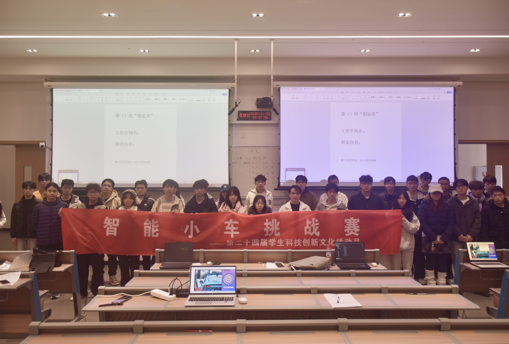
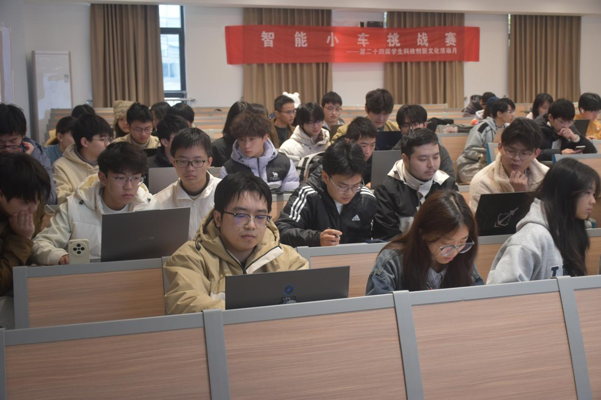

# 【转载】智能小车挑战赛圆满落幕，点燃科技创新热情

2025 年 11 月 23 日，重庆工商大学第二十四届学生科技创新文化活动月的重要赛事 —— 智能小车挑战赛初赛，在校园内顺利开展。此次赛事聚焦 ROS（Robot Operating System，机器人操作系统 ）技术应用，凭借其对智能科技实践能力的深度考察，吸引了全校各学院众多科技爱好者踊跃组队参赛，选手们围绕智能算法开发与硬件实操调试展开激烈比拼，在智能科技的赛道上全力角逐荣誉，为校园科技氛围添上浓墨重彩的一笔。

比赛现场气氛热烈，以 ROS 智能小车技术应用为核心，设置 ROS 小龟画图、人脸识别算法部署、读取 bag 文件并在 Rviz 显示数据三大竞赛模块 。选手需完成 ROS 基本框架搭建、功能包编译、算法部署等实操，还要挑战小龟绘制图形、摄像头图像获取、人脸识别执行、bag 文件播放与 Rviz 数据可视化等任务，对编程技巧、算法优化、硬件调试及 ROS 系统掌握程度要求颇高。各参赛队伍紧密协作、反复调试、调整策略，展现出强大团队精神与创新能力。

本次智能小车挑战赛的成功举办，搭建起了一个智能科技爱好者交流切磋、展示才华的优质平台。它像一颗火种，点燃了更多人对人工智能、智能控制技术尤其是ROS系统应用的探索热情，为智能科技领域注入了新的活力。赛事不仅有力推动了智能科技的发展与创新，也为培养创新型科技人才、促进科技与教育深度融合发挥了积极的促进作用。相信在不久的将来，这些在赛场上大放异彩的智能小车技术，将在工业制造、物流运输、智能家居等多个领域得到广泛应用和拓展，为社会的发展和进步贡献更大的力量。
