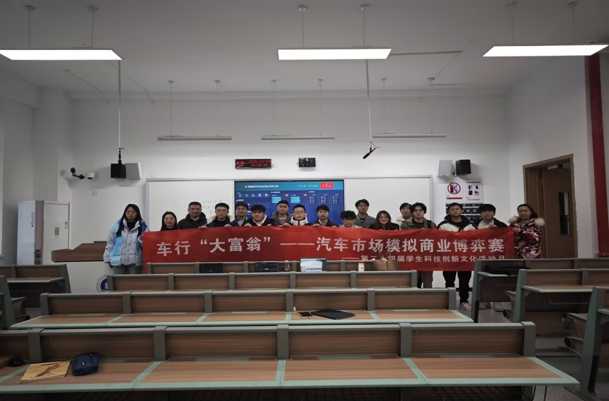
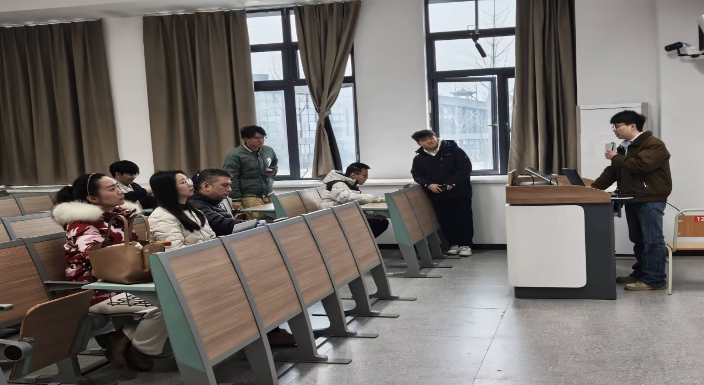
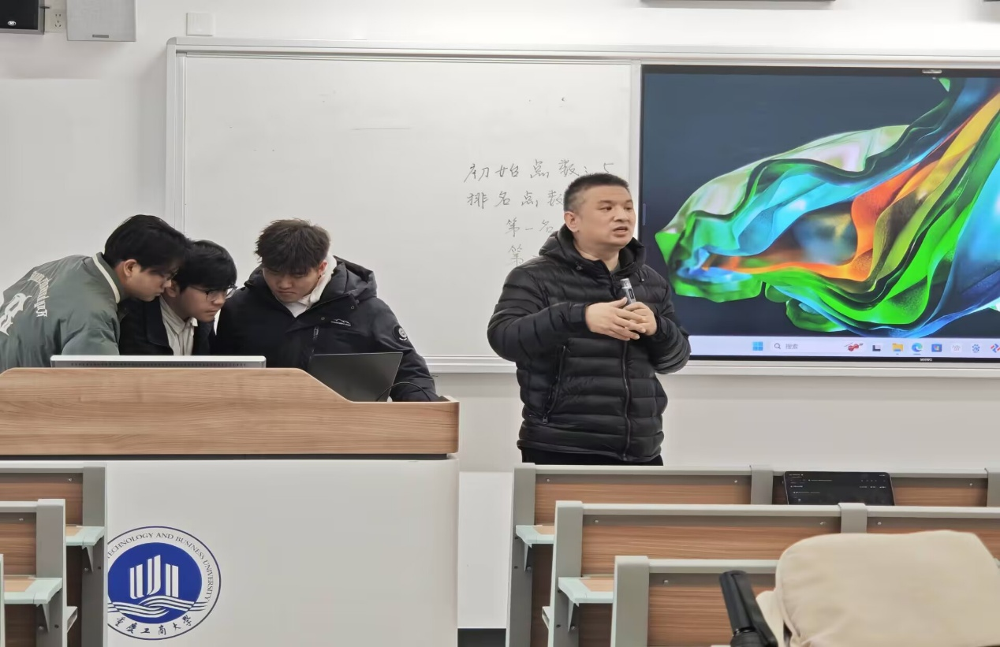
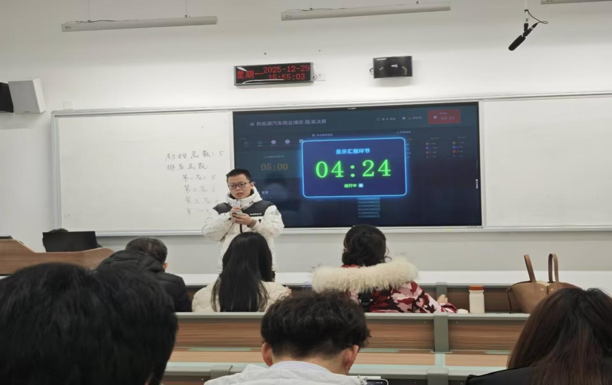

# 【转载】以赛砺商，智竞车市 ——重庆工商大学“车行大富翁”汽车市场模拟商业博弈赛圆满落幕

近日，由重庆工商大学汽车人协会、校科技协会联合主办的“车行‘大富翁’——汽车市场模拟商业博弈赛”顺利收官。本次赛事聚焦新能源汽车市场热点，打造兼具专业性与趣味性的战略营销竞技平台，吸引了全校众多本科生、研究生组队参赛，为校园带来一场精彩的商业实战对决。

赛事自报名启动以来，便受到了同学们的广泛关注。报名阶段，参赛选手以3-4人为单位组建团队，跨专业组队的模式也让不同背景的同学得以携手合作，围绕新能源汽车市场的运营、营销与竞争策略展开前期研讨与准备。11月30日，初赛正式拉开帷幕，各团队在模拟市场环境中，根据实时市场动态制定经营决策，在产品定价、渠道布局、营销推广等环节与其他团队展开博弈，考验着团队的市场分析能力与随机应变能力。经过初赛的激烈角逐，多支队伍成功晋级决赛。

12月中旬，决赛重磅开启。赛场上，晋级队伍围绕更复杂的市场场景与竞争规则展开比拼，从用户画像分析到营销策略落地，从成本控制到市场份额争夺，每一步决策都关乎团队的最终排名。选手们在模拟真实的企业博弈场景中，充分运用商业知识与团队协作，展现了出色的市场洞察力与战略思维。

最终，赛事根据实时排名评选出一等奖1名、二等奖2名、三等奖3名，获奖团队获得了荣誉证书与奖励。

本次“车行大富翁”模拟商业博弈赛，不仅为同学们搭建了理论联系实际的实践平台，更激发了大家对汽车营销与市场分析的兴趣，有效锻炼了跨专业协作与商业决策能力，为培养创新型综合人才提供了宝贵的演练机会。
