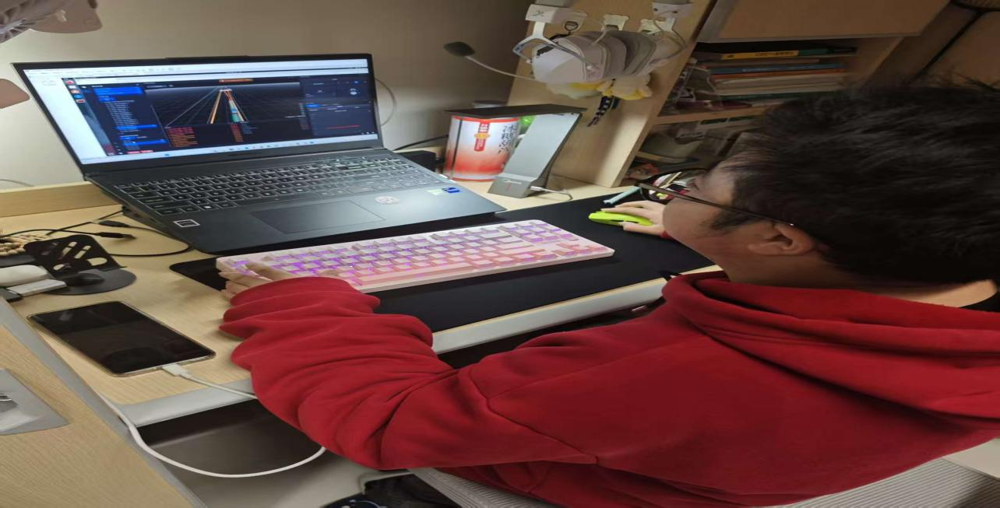
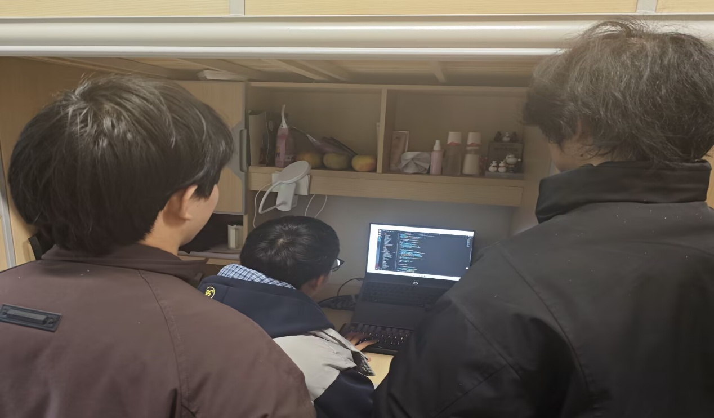

# 【转载】代码驭车，智竞未来 ——重庆工商大学第24届科技创新文化活动月自动驾驶虚拟仿真竞赛圆满落幕

近日，重庆工商大学第24届科技创新文化活动月系列重点赛事——自动驾驶虚拟仿真竞赛顺利收官。本次竞赛由学校汽车人协会、科技协会联合主办，以“代码驱动智能驾驶，实践锤炼工程能力”为主题，吸引了全校多支本科生、研究生队伍同台竞技，为校园科创氛围再添活力。

本次竞赛依托百度Apollo虚拟仿真平台开展，聚焦城市道路真实驾驶场景设置赛题。比赛中，各参赛团队需在规定时间内，围绕车辆路径规划、障碍物避让、交通规则遵守等核心任务，运用C++语言完成自动驾驶控制算法的开发、调试与优化。赛场上，选手们沉着冷静，紧盯平台实时运行数据，快速定位代码漏洞、调整算法参数，反复迭代优化方案，力求让虚拟车辆在复杂路况中实现安全、高效、平稳行驶，展现出扎实的编程功底与极强的问题解决能力。

竞赛现场秩序井然，各环节衔接高效。工作人员全程保障平台稳定运行，及时响应选手需求；评委团队严格按照赛题完成度、行驶安全性、通行效率等标准打分，确保评审公平公正。经过多轮激烈角逐，各奖项尘埃落定：一等奖、二等奖、三等奖分别按参赛队伍总数的15%、30%、40%比例评选，获奖队伍收获荣誉证书与奖励，表现突出的前60%队伍还获得推荐参加中国机器人及人工智能大赛百度Apollo自动驾驶仿真赛校赛的资格。

本次自动驾驶虚拟仿真竞赛，为广大学子搭建了理论知识对接工程实践、专业技能对接产业前沿的优质平台，有效深化了同学们对自动驾驶技术的理解，全面锻炼了编程能力、算法思维与团队协作水平。赛事以赛促学、以赛促练、以赛促创，是学校推进新工科人才培养、强化科创实践育人的生动体现，更为培育智能驾驶领域创新型、应用型青年人才注入强劲动能。
